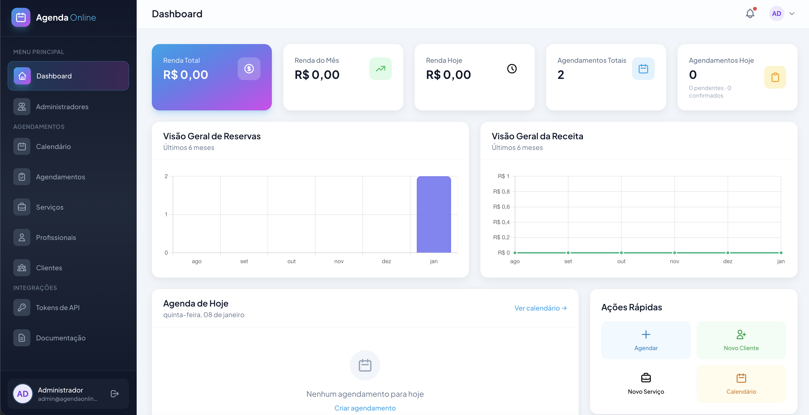
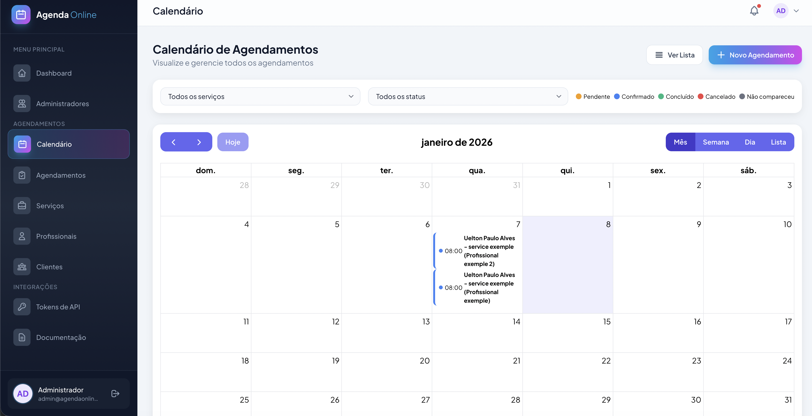
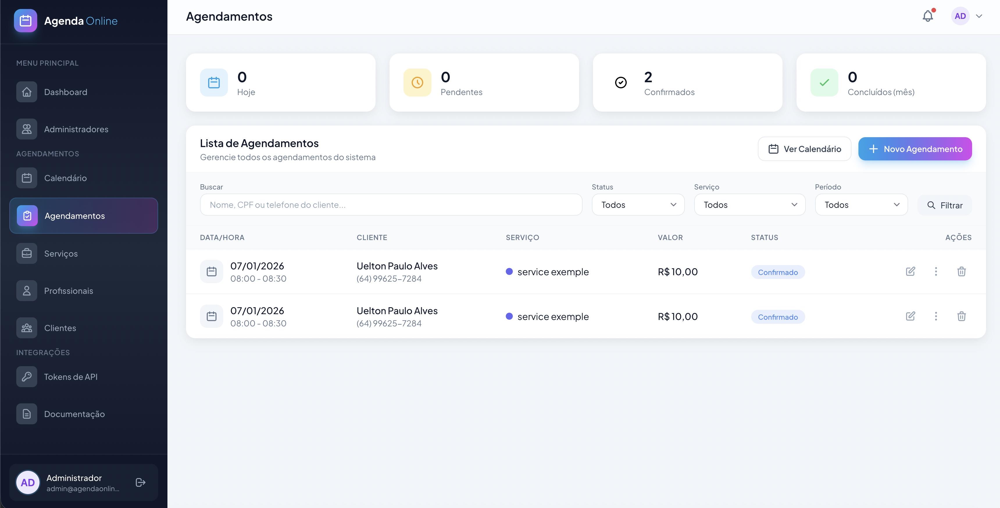
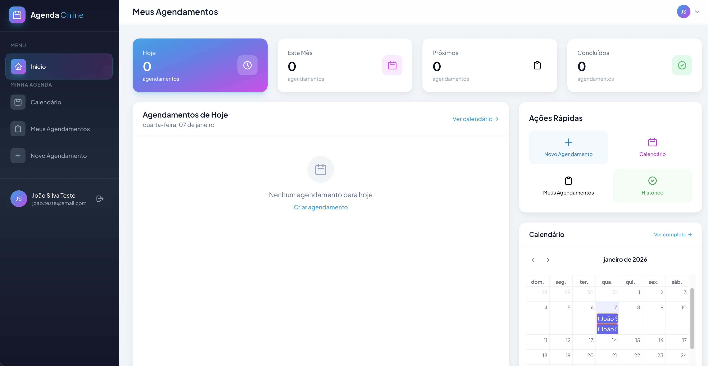

<p align="center">
  
</p>

<h1 align="center">📅 Agenda Online</h1>

<p align="center">
  <strong>Sistema de Agendamento Online completo para empresas e profissionais</strong>
</p>

<p align="center">
  
  
  
  
  
</p>

<p align="center">
  <a href="#-sobre-o-projeto">Sobre</a> •
  <a href="#-funcionalidades">Funcionalidades</a> •
  <a href="#-screenshots">Screenshots</a> •
  <a href="#-tecnologias">Tecnologias</a> •
  <a href="#-instalação">Instalação</a> •
  <a href="#-api">API</a> •
  <a href="#-contribuição">Contribuição</a>
</p>

---

## ⚠️ Projeto em Desenvolvimento

> **Este projeto está em desenvolvimento ativo!** Estamos trabalhando continuamente para adicionar novas funcionalidades e melhorar a experiência do usuário. Algumas funcionalidades podem estar incompletas ou em fase de testes.
>
> **Contribuições, ideias e sugestões são muito bem-vindas!** Se você tiver interesse em contribuir ou sugerir melhorias, sinta-se à vontade para abrir uma issue ou pull request.

---

## 📋 Sobre o Projeto

O **Agenda Online** é um sistema completo de agendamento desenvolvido com Laravel 12, projetado para atender empresas de diversos segmentos que necessitam gerenciar agendamentos de serviços com múltiplos profissionais.

O sistema foi desenvolvido com foco em:
- **Flexibilidade**: Suporta tanto empresas com um único profissional quanto múltiplos profissionais
- **Facilidade de uso**: Interface moderna e intuitiva para administradores e clientes
- **Automação**: API RESTful completa para integração com ferramentas como n8n, Zapier, etc.
- **Responsividade**: Design adaptável para desktop, tablet e mobile

### Casos de Uso

- 💇 Salões de beleza e barbearias
- 🏥 Clínicas e consultórios
- 🎓 Escolas e instrutores
- 🔧 Prestadores de serviços em geral
- 🏢 Qualquer negócio que trabalhe com agendamentos

---

## ✨ Funcionalidades

### 👨‍💼 Painel Administrativo

| Módulo | Funcionalidades |
|--------|-----------------|
| **Dashboard** | Visão geral com estatísticas, gráficos de receita, agenda do dia e ações rápidas |
| **Agendamentos** | CRUD completo, filtros por status/data/profissional, calendário interativo |
| **Profissionais** | Cadastro de profissionais, vinculação com serviços, cores personalizadas |
| **Serviços** | Cadastro de serviços, preços, duração, associação com profissionais |
| **Clientes** | Gestão de clientes, histórico de agendamentos, dados de contato |
| **Calendário** | Visualização mensal/semanal/diária, drag & drop (em desenvolvimento) |
| **API** | Gestão de tokens, documentação interativa |

### 👤 Área do Cliente

| Módulo | Funcionalidades |
|--------|-----------------|
| **Dashboard** | Próximos agendamentos, histórico, ações rápidas |
| **Novo Agendamento** | Seleção de serviço, profissional, data e horário disponível |
| **Meus Agendamentos** | Lista de agendamentos, detalhes, cancelamento |
| **Calendário** | Visualização dos agendamentos pessoais |

### 🔌 API RESTful

A API foi desenvolvida com o objetivo de permitir **automações** através de ferramentas como **n8n**, **Zapier**, **Make**, entre outras. Principais endpoints:

- ✅ Listar/criar/atualizar/cancelar agendamentos
- ✅ Verificar horários disponíveis por profissional
- ✅ Listar profissionais e seus serviços
- ✅ Listar serviços disponíveis
- ✅ Cadastro e gestão de clientes
- ✅ Consultar dias e horários disponíveis
- ✅ Autenticação via token Bearer

---

## 📸 Screenshots

### Painel Administrativo

<p align="center">
  
  <br><em>Dashboard Administrativo</em>
</p>

<p align="center">
  
  <br><em>Calendário de Agendamentos</em>
</p>

<p align="center">
  
  <br><em>Lista de Agendamentos</em>
</p>

<p align="center">
  
  <br><em>Gestão de Profissionais</em>
</p>

### Área do Cliente

<p align="center">
  
  <br><em>Dashboard do Cliente</em>
</p>

<p align="center">
  
  <br><em>Tela de Novo Agendamento</em>
</p>

---

## 🛠️ Tecnologias

### Backend
- **[Laravel 12](https://laravel.com/)** - Framework PHP
- **[PHP 8.5](https://www.php.net/)** - Linguagem de programação
- **[MySQL](https://www.mysql.com/) / [MariaDB](https://mariadb.org/)** - Banco de dados
- **[Laravel Sanctum](https://laravel.com/docs/sanctum)** - Autenticação de API

### Frontend
- **[TailwindCSS 3](https://tailwindcss.com/)** - Framework CSS
- **[Alpine.js 3](https://alpinejs.dev/)** - Framework JavaScript reativo
- **[Vite](https://vitejs.dev/)** - Build tool e dev server

### Ferramentas de Desenvolvimento
- **[Composer](https://getcomposer.org/)** - Gerenciador de dependências PHP
- **[NPM](https://www.npmjs.com/)** - Gerenciador de pacotes Node.js

---

## 🚀 Instalação

### Pré-requisitos

- PHP >= 8.2
- Composer >= 2.0
- Node.js >= 18.x
- NPM >= 9.x
- MySQL >= 8.0 ou MariaDB >= 10.5
- Git

### Passo a Passo

#### 1. Clone o repositório

```bash
git clone https://github.com/uelton22/agenda_online.git
cd agenda_online
```

#### 2. Instale as dependências do PHP

```bash
composer install
```

#### 3. Instale as dependências do Node.js

```bash
npm install
```

#### 4. Configure o ambiente

```bash
# Copie o arquivo de exemplo
cp .env.example .env

# Gere a chave da aplicação
php artisan key:generate
```

#### 5. Configure o banco de dados

Edite o arquivo `.env` com suas credenciais:

```env
DB_CONNECTION=mysql
DB_HOST=127.0.0.1
DB_PORT=3306
DB_DATABASE=agenda_online
DB_USERNAME=seu_usuario
DB_PASSWORD=sua_senha
```

#### 6. Execute as migrações

```bash
# Crie o banco de dados manualmente e depois execute:
php artisan migrate
```

#### 7. (Opcional) Popule com dados de exemplo

```bash
php artisan db:seed
```

#### 8. Compile os assets

```bash
# Desenvolvimento
npm run dev

# Produção
npm run build
```

#### 9. Inicie o servidor

```bash
php artisan serve
```

Acesse: `http://localhost:8000`

### 🐳 Instalação com Docker (Em breve)

```bash
# Em desenvolvimento...
docker-compose up -d
```

---

## 📡 API

### Autenticação

A API utiliza autenticação via **Bearer Token**. Para obter um token:

1. Acesse o painel administrativo
2. Vá em **Integrações > Tokens de API**
3. Crie um novo token

### Endpoints Principais

#### Agendamentos

| Método | Endpoint | Descrição |
|--------|----------|-----------|
| GET | `/api/appointments` | Lista todos os agendamentos |
| POST | `/api/appointments` | Cria um novo agendamento |
| GET | `/api/appointments/{id}` | Detalhes de um agendamento |
| PUT | `/api/appointments/{id}` | Atualiza um agendamento |
| DELETE | `/api/appointments/{id}` | Cancela um agendamento |
| GET | `/api/appointments/available-slots` | Horários disponíveis |

#### Profissionais

| Método | Endpoint | Descrição |
|--------|----------|-----------|
| GET | `/api/professionals` | Lista profissionais |
| GET | `/api/professionals/{id}` | Detalhes do profissional |
| GET | `/api/professionals/{id}/services` | Serviços do profissional |
| GET | `/api/professionals/{id}/available-slots` | Horários disponíveis |

#### Serviços

| Método | Endpoint | Descrição |
|--------|----------|-----------|
| GET | `/api/services` | Lista serviços |
| GET | `/api/services/{id}` | Detalhes do serviço |

#### Clientes

| Método | Endpoint | Descrição |
|--------|----------|-----------|
| GET | `/api/clients` | Lista clientes |
| POST | `/api/clients` | Cadastra cliente |
| GET | `/api/clients/{id}` | Detalhes do cliente |

### Exemplo de Uso com cURL

```bash
# Listar horários disponíveis
curl -X GET "http://seu-dominio.com/api/appointments/available-slots?service_id=1&date=2026-01-15" \
  -H "Authorization: Bearer SEU_TOKEN" \
  -H "Accept: application/json"

# Criar agendamento
curl -X POST "http://seu-dominio.com/api/appointments" \
  -H "Authorization: Bearer SEU_TOKEN" \
  -H "Accept: application/json" \
  -H "Content-Type: application/json" \
  -d '{
    "service_id": 1,
    "professional_id": 1,
    "client_id": 1,
    "scheduled_at": "2026-01-15 10:00:00",
    "notes": "Observações do agendamento"
  }'
```

### 🔄 Integração com n8n

A API foi projetada para facilitar automações com **n8n**. Casos de uso:

- **WhatsApp Bot**: Receber mensagens e agendar automaticamente
- **Notificações**: Enviar lembretes por email/SMS/WhatsApp
- **Sincronização**: Integrar com Google Calendar
- **Relatórios**: Gerar relatórios automáticos
- **CRM**: Sincronizar clientes com outras plataformas

Para documentação completa da API, acesse: **Painel Admin > Integrações > Documentação**

---

## 📁 Estrutura do Projeto

```
agenda_online/
├── app/
│   ├── Http/
│   │   ├── Controllers/
│   │   │   ├── Admin/          # Controllers do painel admin
│   │   │   ├── Api/            # Controllers da API
│   │   │   └── Client/         # Controllers da área do cliente
│   │   └── Middleware/
│   └── Models/                 # Models Eloquent
├── database/
│   ├── migrations/             # Migrações do banco
│   └── seeders/                # Seeds de dados
├── resources/
│   ├── css/                    # Estilos CSS
│   ├── js/                     # JavaScript
│   └── views/
│       ├── admin/              # Views do admin
│       ├── client/             # Views do cliente
│       └── layouts/            # Layouts base
├── routes/
│   ├── api.php                 # Rotas da API
│   └── web.php                 # Rotas web
├── public/                     # Arquivos públicos
└── docs/
    └── screenshots/            # Screenshots do sistema
```

---

## 🗓️ Roadmap

### ✅ Implementado

- [x] CRUD de Agendamentos
- [x] CRUD de Serviços
- [x] CRUD de Clientes
- [x] CRUD de Profissionais
- [x] Área do Cliente
- [x] Sistema de autenticação (Admin e Cliente)
- [x] Calendário interativo
- [x] API RESTful completa
- [x] Documentação da API
- [x] Dashboard com estatísticas

### 🚧 Em Desenvolvimento

- [ ] Notificações por email
- [ ] Integração com WhatsApp
- [ ] Módulo Financeiro (Contas a Receber/Pagar)
- [ ] Relatórios avançados
- [ ] Drag & Drop no calendário
- [ ] PWA (Progressive Web App)
- [ ] Docker support

### 💡 Planejado

- [ ] Multi-tenancy (múltiplas empresas)
- [ ] Pagamentos online
- [ ] App mobile (React Native)
- [ ] Integração Google Calendar
- [ ] Sistema de fidelidade
- [ ] Avaliações de serviço

---

## 🤝 Contribuição

Contribuições são **muito bem-vindas**! Este é um projeto em desenvolvimento e toda ajuda é apreciada.

### Como Contribuir

1. Faça um Fork do projeto
2. Crie uma branch para sua feature (`git checkout -b feature/AmazingFeature`)
3. Commit suas mudanças (`git commit -m 'Add: nova funcionalidade'`)
4. Push para a branch (`git push origin feature/AmazingFeature`)
5. Abra um Pull Request

### Tipos de Contribuição

- 🐛 **Bug fixes**: Correção de erros
- ✨ **Features**: Novas funcionalidades
- 📝 **Documentação**: Melhorias na documentação
- 🎨 **UI/UX**: Melhorias na interface
- ♻️ **Refatoração**: Melhorias no código
- 🌐 **Traduções**: Suporte a novos idiomas

---

## 📄 Licença

Este projeto está sob a licença MIT. Veja o arquivo [LICENSE](LICENSE) para mais detalhes.

---

## 👨‍💻 Autor

**Uelton Paulo Alves**

- GitHub: [@uelton22](https://github.com/uelton22)

---

## 🙏 Agradecimentos

- [Laravel](https://laravel.com/)
- [TailwindCSS](https://tailwindcss.com/)
- [Alpine.js](https://alpinejs.dev/)
- Todos os contribuidores e apoiadores do projeto

---

<p align="center">
  Feito com ❤️ por <a href="https://github.com/uelton22">Uelton Paulo Alves</a>
</p>

<p align="center">
  <a href="#-agenda-online">⬆️ Voltar ao topo</a>
</p>
